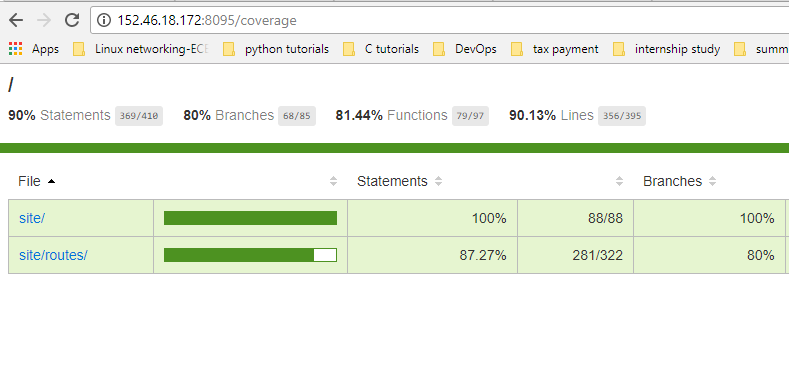

# DevOps_Milestone2

## Team Members:
+ Nupur Pradeep Sakhalkar (nsakhal)
+ Neha Pradeep Sakhalkar (nsakhal2)
+ Divyapuja Vitonde (davitond)
+ Cherukeshi Machan (cmachan)


## Report

### Approaches followed for the project milestone completion
#### 1. Fuzzer Implementation
+ For implementing the fuzzer, firstly, all the .java files present inside the `iTrust2-v2/iTrust2/src/main/java/edu/ncsu/csc/itrust2/` directory were read recursively. A list containing the complete path to these files was stored in an array object of nodejs. This file list was then sampled randomly to generate a new file list which was provided as an input to the `mutationTesting` function for doing the fuzzing operation. Moreover, one of the fuzzing operation included swaping `<` with `>`. This swapping operation lead to compilation error due to the change in the generic template format(undesirable change) in some .java files. In order to overcome this issue, the generic types inside all the files were noted down and stored in an array and then by using regex matching operation, any line containing any one of those generic type (present in the array) was excluded from the fuzzing operation. Moreover, it was found that swapping of 0 with 1 in certain files lead to variable name change, which also lead to compilation errors. 
+ Before pushing the changes made in the `src` folder to the `fuzzer` branch of the remote git repository, the edited files were compiled using the `mvn compile` command. The changes made in the `src` files were pushed to remote only if maven compilation was successful. If the compilation failed, all the changes were reset by using the `git reset` command. On successful compilation, the edited code was pushed into the remote git repository and then a jenkins job was triggered based on that git commit ID. After triggering the Jenkins build job for iTrust, `git revert` was used to revert back to the original code on the fuzzer branch. Reverting and reseting back to the original code was used as a rollback mechanism to get back the original unchanged code, ready to be used for the next iteration. The entire cycle was repeated for `n` iterations where `n` was the number of random fuzzer commits.  

**Certain ways in which fuzzing operation can be extended in the future**  
+ As observed in this project milestone, sometimes, certain fuzzing operations result in some alteration in the variable name/identifier, which leads to `identifier not found error`. This error is not due to the code inefficiency/bad coding; its because of failure of the fuzzer to identify places where fuzzing operation might result in such type of errors. Thus, the fuzzing operation should be improved to distinguish between a variable/identifier name and its value. So that, only the value of the variable is changed randomly for fuzz testing and not the variable name itself, which might lead to unneccessary compilation errors. Also, to avoid compilation errors due to certain format change(for eg: change in the generic type template format), fuzzer should be developed to determine the type of file and the associated formats used depending on the file extension and refrain from editing the important templates/formats that would result to compilation errors. 

 
#### 2. Test prioritization
The files on which test prioritization was performed is present under the [builds](https://github.ncsu.edu/nsakhal/DevOpsProjectMilestone2/tree/master/builds) (for 107 random fuzzer commits test analysis) folder and the [testReports](https://github.ncsu.edu/nsakhal/DevOpsProjectMilestone2/tree/master/testReports) folder (for iTrust test suite runs).   
The test prioritization analysis was divided into two parts:  
1. Test prioritization for random fuzzer commits  
2. Test prioritization for test suite runs  

**1. Test prioritization for random fuzzer commits**  
Running the fuzzer `n` number of times resulted in `n` random commits. These random commits, in turn, resulted in triggering of `n` number of Jenkins' build for iTrust. The Jenkins build success/failure report as well as the time taken for the build can be found in the `build.xml` present in the `builds` folder of that Jenkins job. For implementing test prioritization analysis, `build.xml` of all the iTrust builds' were parsed one by one and the status (SUCCESS/FAILURE) along with the time taken for that build was stored in an array object. After all the files were successfully parsed, a sort function was used to sort all the `failed` builds before the `successful/passed` builds. Among all the tests that failed, the less time consuming builds were arranged before the test cases that took more time to build using the sort function. Same idea was implemeted for the test cases that passed.  

**2. Test prioritization for test suite runs**  
The success/failure report for the test suite run was taken from the `surefire-reports` folder generated inside the `target` directory of the Jenkins job workspace. As the `target` folder is updated during every new build, the generated `surefire-report` for a specific build was saved in a `/var/lib/jenkins/jobs/iTrustBuildJob/testReports/<Build_number>`
location. A folder corresponding to the build number was created for every build and the `surefire-report` for a specific build was stored in the folder corresponding to that build number. Once all the builds were completed, the nodejs script was executed to sort the test cases for every build. All the `.xml` files inside the `surefire-reports` were parsed one by one to determine the failure/success of testcases along with the time required for their execution. All the `failed` tests are ranked higher than the `passed` ones and within each category (i.e either fail or passed), sorting was done based on the time required for that test case execution. The less time consuming test cases were placed higher than the more time consuming ones. Also, sorting was done per build, i.e, the test cases within a specific build were sorted with respect to each other; sorting was not done with the test cases from another build. 


#### 3. Automated Test Generation
For Automated test generation, we have used sinon-mock module . We are mocking MongoDB Collection object. Whenever there will be any call to Collection object, predefined result will be yielded. As mocking has to be before application run so we are creating a file testMain.js automatically from server.js file . This file will mock the Collection object and then will listen to test environment port. Request to the REST calls will be done from file test.js that will auto generated. Main.js file is the main file that will generate all the test cases.  istanbul-middleware is used for the code coverage. 

Following are the steps to perform the tests.

***Step 1***: run "node main.js" >> this will auto generate testMain.js and test.js files . The testMain.js file contains all test data , mocking commands and code to run the application on test environment. The test.js contains all request commands for testing.

***Step2***: run "node istanbulfile.js --coverage &" >> this command will run the application on background and will start capturing the coverage.

***Step3***: run "node test.js" >> This command will run all the test cases.

+ Total number of test taken are : 43

+ Resulting coverage is 80%
  

 
#### 4. Configuration of Jenkins and Coverage
using local machine, jenkins build was taking taking 20-30 min, hence I used VCL, which drastically improved Jenkins build time from 20-30 min to 3-4 min. Following steps explains the approach I took.</br>
1. Git cloned Professors repo for iTrust and Checkbox.</br>
2. Built the code files as per necessary configurations such as email.properties</br>
3. Created a jenkins job using jenkins-cli.jar</br>
4. Once the jenkins job needs to be get created , I copied the project files into the jobs directory.</br>
5. I tried to use REST API to create jenkins job but that was not working correctly in case a job is already created, hence I followed the better approach to first check if a job is created or not at first. If not, then only create a new jenkins job. I used jenkins-cli.jar.</br>
6. I first copied the files into jenkins/jobs directory and then copied into jenkins/workspace directory. This was required because as a part of ansible script, when the job is triggered in jenkins then only the workspace folder is created. We need the correctly configured files into jenkins workspace directory at the time of building the job. Hence, I let the ansible script to first copy all the files into jenkins job folder and then at every build trigger in the jenkins build action bash script I copy the files from jobs  directory to workspace directory</br>
7. If we have used gitSCM polling with jenkins such that the files present in the github repo are completely configured correctly then simply using github jenkins plugin , we could have simply asked jenkins to git clone the code each time the build triggers into jenkins workspace folder and Using ansible to do all this configuration was a very good learning experience.</br>
8. If the permissions are not set correctly within var/lib/jenkins/jobs directory then jenkins UI doesn't allow us to delete the job ( if we need to do so) Hence, I made sure in my ansible scripts that before ansible triggers the build, all the files in var/lib/jenkins have jenkins:jenkins user and usergroup.</br>
9. I used jacoco plugin to check the coverage report for iTrust after successfull builds. To check coverage for checkbox, since it requires background process as well, I assigned 8095 port, to avoid conflict with same port number. The steps that are required to run to create coverage for checkbox are included in the xml file apart from the setup things.</br>


## Steps to be followed:

- `git clone https://github.ncsu.edu/nsakhal/DevOpsProjectMilestone2.git`
- `cd DevOpsProjectMilestone2`
- `sh installAnsible.sh` (For ansible installation)
- Edit the [ssh_config.j2](https://github.ncsu.edu/nsakhal/DevOpsProjectMilestone2/blob/master/JenkinsBuildServer/applications/templates/ssh_config.j2) file located inside DevOpsProjectMilestone2/JenkinsBuildServer/applications/templates folder with your ncsu unity id 
- Edit the [id_rsa](https://github.ncsu.edu/nsakhal/DevOpsProjectMilestone2/blob/master/JenkinsBuildServer/applications/tasks/id_rsa) file located inside DevOpsProjectMilestone2/JenkinsBuildServer/applications/tasks folder with your github private key contents
- Edit the [configureGit.yml](https://github.ncsu.edu/nsakhal/DevOpsProjectMilestone2/blob/master/JenkinsBuildServer/applications/tasks/configureGit.yml) file present inside DevOpsProjectMilestone2/JenkinsBuildServer/applications/tasks folder with your ncsu github username (e.g. nsakhal) and ncsu email id (e.g. nsakhal@ncsu.edu)
- Run the following commands now:
```
- ansible-playbook installJenkins1.yml
- ansible-playbook setup2.yml
- ansible-playbook JenkinsBuildServer/main.yml
```
- After running main.yml, you can check the Jenkins up and running on ' http://<SERVER_PUBLIC_IP_ADDRESS>:8090 ' where SERVER_PUBLIC_IP is the IP address obtained during VCL reservation
- To check iTrust coverage, check Coverage Trend on Jenkins Dashboard.
- To check Checkbox coverage, check ' http://<SERVER_PUBLIC_IP_ADDRESS>:8095/coverage '.
```
- ansible-playbook JenkinsBuildServer/fuzzer.yml
- sudo npm install 
- sudo node main.js
```
+ [`installAnsible.sh`](https://github.ncsu.edu/nsakhal/DevOpsProjectMilestone2/blob/master/installAnsible.sh) script is used for Ansible installation
+ [`fuzzer.yml`](https://github.ncsu.edu/nsakhal/DevOpsProjectMilestone2/blob/master/JenkinsBuildServer/fuzzer.yml) is used for executing the commit fuzzer. [fuzzer.js](https://github.ncsu.edu/nsakhal/DevOpsProjectMilestone2/blob/master/JenkinsBuildServer/fuzzer.js) script is used for implementing the automated commit fuzzer 

## Few points to note:
+ Update [`id_rsa`](https://github.ncsu.edu/nsakhal/DevOpsProjectMilestone2/blob/master/JenkinsBuildServer/applications/tasks/id_rsa) with the private key value associated with your NCSU github account (Create an ssh key pair. Then add the public key of the created ssh key pair on your github account. Finally copy and paste the content of the created private key in the `id_rsa` file)
+ Update the [`ssh_config.j2`](https://github.ncsu.edu/nsakhal/DevOpsProjectMilestone2/blob/master/JenkinsBuildServer/applications/templates/ssh_config.j2) file with your github username.
+ Update the [`configureGit.yml`](https://github.ncsu.edu/nsakhal/DevOpsProjectMilestone2/blob/master/JenkinsBuildServer/applications/tasks/configureGit.yml) playbook with the NCSU github username and email address 
+ Ubuntu 14.04 Base NCSU VCL machine was used as the base machine for implementing this project milestone. Kindly use this as the base image for testing.

## Contributions
**1. Nupur Pradeep Sakhalkar(nsakhal)**  
+ Setup of iTrust Build job
+ Initial Jenkins Setup for bypyassing Jenkins Plugin wizard
+ Setting up postBuild task required for test prioritization analysis 
+ Overall integration task of fuzzer and test prioritization analysis modules with the Jenkins ITrust setup module

**2. Neha Pradeep Sakhalkar(nsakhal2)**  
+ Automated Commit Generation - Commit Fuzzer
+ Test prioritization analysis

**3. Cherukeshi Machan (cmachan)**  
+ Automated Test Generation
+ Checkbox.io test coverage

**4. Divyapuja Vitonde (davitond)**  
+ Jenkins setup and configuration for iTrust and Checkbox
+ Coverage report using Jacoco plugin  
+ Create and build job using jenkins-cli.jar
+ Configurations of plugins and dependancies

## Screencast Links
+ Link to Jenkins setup and coverage report generation can be found on this [link](https://youtu.be/9qSlKHlvXCU)
+ Link to fuzzer and test prioritization analysis screencast can be found on this [link](https://youtu.be/MqPQk6Ele68)


## References
+ [Git Revert](https://www.atlassian.com/git/tutorials/undoing-changes/git-revert)
+ [execSync](https://nodejs.org/api/child_process.html#child_process_child_process_execsync_command_options)
+ [slash](https://github.com/sindresorhus/slash)
+ [forEach JavaScript](https://developer.mozilla.org/en-US/docs/Web/JavaScript/Reference/Global_Objects/Array/forEach)
+ [recursive-readdir-sync](https://github.com/battlejj/recursive-readdir-sync)
+ [git-rev-sync](https://github.com/kurttheviking/git-rev-sync-js)
+ [Regex Test](https://developer.mozilla.org/en-US/docs/Web/JavaScript/Reference/Global_Objects/RegExp/test)
+ [includes Javascript](https://www.w3schools.com/jsref/jsref_includes.asp)
+ [Array functions](https://www.w3schools.com/jsref/jsref_obj_array.asp)
+ [Jenkins job build using curl](http://nrecursions.blogspot.in/2014/02/how-to-trigger-jenkins-build-on-git.html)
+ [spawnSync](https://nodejs.org/api/child_process.html#child_process_child_process_spawnsync_command_args_options)
+ [sort](https://developer.mozilla.org/en-US/docs/Web/JavaScript/Reference/Global_Objects/Array/sort)
+ [Parameterized JenkinsBuild](https://wiki.jenkins.io/display/JENKINS/Parameterized+Build)
+ [MongoDB Autherization fail](https://stackoverflow.com/questions/18216712/cannot-authenticate-into-mongo-auth-fails)
+ [Ansible-Jenkins wizard issue](https://github.com/geerlingguy/ansible-role-jenkins/issues/181)
+ [jacoco coverage](https://www.petrikainulainen.net/programming/maven/creating-code-coverage-reports-for-unit-and-integration-tests-with-the-jacoco-maven-plugin/)


